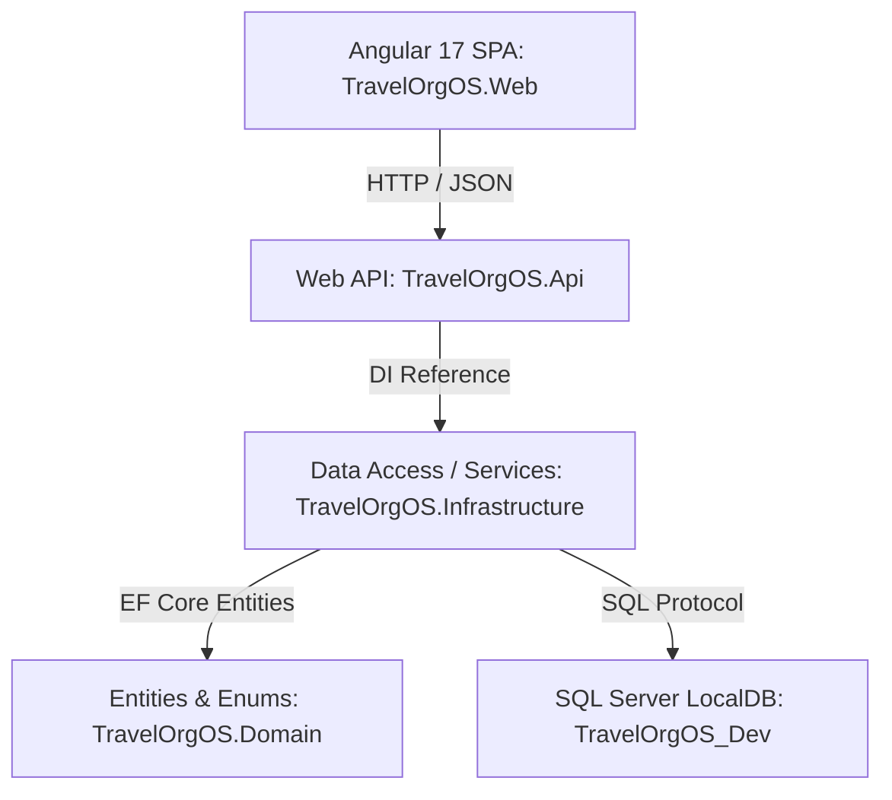

# TravelOrgOS - Overall Project Documentation

Welcome to the comprehensive overall guide for the **TravelOrgOS (Travel Organization Operating System)**. This document serves as the master entry point to understand the repository architecture, database scheme, API endpoints, frontend client structure, security protocols, and operational workflows.

---

## 1. Executive Summary & Product Vision

**TravelOrgOS** is a multi-tenant B2B Software-as-a-Service (SaaS) platform designed for travel agencies, tour operators, group tour companies, and travel management organizations. It unifies operations across trips, itineraries, travellers, bookings, payments, and fleet logistics into a single platform.

Each organization (tenant) receives:
1. **Admin Workspace**: An administrative dashboard to orchestrate trips, manage passenger lists, inspect sales charts, and handle accounting ledgers.
2. **Mobile-First Traveller Portal**: A branded, responsive booking interface tailored dynamically with the organization's color scheme, logo, and custom messaging, allowing travellers to browse trips and make instant bookings.

---

## 2. Technology Stack

The project utilizes a modern, robust, and clean development stack:

| Layer | Technology | Details |
| :--- | :--- | :--- |
| **Backend Core** | .NET 8 SDK | ASP.NET Core Web API with clean architecture boundaries |
| **ORM** | Entity Framework Core 8 | Code-first mapping with automated seeds |
| **Database** | SQL Server LocalDB | Instance: `(localdb)\MSSQLLocalDB` (dev-only sandbox) |
| **Frontend SPA** | Angular 17 | Standalone components, Tailwind CSS/custom styles, and reactive router |
| **Testing** | xUnit | Integration and unit testing suite for key domain rules |
| **Automation** | PowerShell Core | Dev environment bootstrap and service execution scripts |

---

## 3. Directory Layout

The repository is structured logically to separate system domains:

```text
TravelOrgOS/
│
├── .agents/                    # Custom agent instructions and workspace rules
├── database/                   # Schema scripts and seeds
│   ├── scripts/                # SQL scripts for DB initialization & reset
│   └── seed/                   # Raw seed files and source structures
│
├── docs/                       # Project Documentation Library
│   ├── API.md                  # REST controller endpoints and API specs
│   ├── ARCHITECTURE.md         # Deep-dive on Clean Architecture patterns
│   ├── DATABASE.md             # Connection strings and database schemas
│   ├── DEMO-GUIDE.md           # Scripted walkthrough steps for sales demos
│   ├── ROADMAP.md              # Milestones, completed features, and future phases
│   ├── SYSTEM_OVERVIEW.md      # High-level architecture mapping
│   ├── TRAVELORGOS-PRODUCT-AUDIT.md # Technical debt, gaps, and priority action items
│   └── PROJECT_OVERVIEW.md     # [THIS FILE] Unified overall project documentation
│
├── scripts/                    # Automation and utility scripts
│   ├── setup.ps1               # Initializes SQL LocalDB, installs node_modules
│   ├── run-api.ps1             # Launches ASP.NET Core API on port 5100
│   ├── run-web.ps1             # Launches Angular SPA on port 4400
│   └── reset-demo-data.ps1     # Restores database to baseline seed state
│
├── src/                        # Application Source Code
│   ├── TravelOrgOS.Domain/     # Domain layer (Entities, DTOs, Enums)
│   ├── TravelOrgOS.Infrastructure/ # Data access, EF Context, Services, Gateways
│   ├── TravelOrgOS.Api/        # REST Controllers, JWT configs, auth middleware
│   └── TravelOrgOS.Web/        # Angular 17 frontend application
│
└── tests/                      # Automated Verification
    └── TravelOrgOS.Api.Tests/  # xUnit tests for calculations, safety, and tenant bounds
```

---

## 4. Architectural Boundaries (.NET Clean Architecture)

The system enforces strict architectural layers to ensure separation of concerns and maintainability:



### 4.1 Domain Layer (`TravelOrgOS.Domain`)
This layer is entirely self-contained and holds no dependencies on frameworks, databases, or external libraries.
- **Entities**: [Entities.cs](file:///c:/personal/TravelOrgOS/src/TravelOrgOS.Domain/Entities/Entities.cs) defines the schema structure representing `Organization`, `Trip`, `Booking`, `Payment`, `Traveller`, `Hotel`, `Vehicle`, `Vendor`, and `AuditLogs`.
- **Enums**: [DomainEnums.cs](file:///c:/personal/TravelOrgOS/src/TravelOrgOS.Domain/Enums/DomainEnums.cs) controls system states including `UserRole`, `TripStatus`, `BookingStatus`, and `PaymentStatus`.
- **DTOs**: [Dtos.cs](file:///c:/personal/TravelOrgOS/src/TravelOrgOS.Domain/DTOs/Dtos.cs) holds request-response shapes exchanged between the API and client.

### 4.2 Infrastructure Layer (`TravelOrgOS.Infrastructure`)
This layer handles the persistence and external service interfaces.
- **Database Context**: [TravelOrgOSDbContext.cs](file:///c:/personal/TravelOrgOS/src/TravelOrgOS.Infrastructure/Data/TravelOrgOSDbContext.cs) maps Entities to physical tables.
- **Services**: Heavy business logic and operations live here.
  - [BookingService.cs](file:///c:/personal/TravelOrgOS/src/TravelOrgOS.Infrastructure/Services/BookingService.cs): Prevents overbooking, updates seats, and processes pricing math.
  - [TripService.cs](file:///c:/personal/TravelOrgOS/src/TravelOrgOS.Infrastructure/Services/TripService.cs): Powers the multi-step Trip Builder.
  - [TravellerService.cs](file:///c:/personal/TravelOrgOS/src/TravelOrgOS.Infrastructure/Services/TravellerService.cs): Validates and imports traveller lists from CSV inputs.
- **Payment Gateways**: Pluggable architectures in [Services/Payment](file:///c:/personal/TravelOrgOS/src/TravelOrgOS.Infrastructure/Services/Payment) for Stripe, Razorpay, and Mock operations.

### 4.3 Web API Layer (`TravelOrgOS.Api`)
The interface controllers expose REST endpoints securely using token authentication.
- **Endpoints**: [Controllers/](file:///c:/personal/TravelOrgOS/src/TravelOrgOS.Api/Controllers) handles authentication, reporting, trip publishing, CSV uploading, and webhook ingestion.
- **Authentication**: Validates incoming JWT tokens and extracts role-based permissions and claims.

### 4.4 Web Frontend (`TravelOrgOS.Web`)
An Angular 17 Standalone Single Page Application.
- **Admin App**: Renders stateful dashboards, steppers, and analytics grids.
- **Traveller Portal**: Renders mobile-first branded landing and booking pages utilizing values defined in the organization profile (primary/secondary branding colors, logo URL, custom slogan).

---

## 5. Security & Safety Enforcements

### 5.1 Critical Database Safety Guarantee
To protect production databases and corporate servers, the backend includes an automated connection barrier.

> [!CAUTION]
> **LOCALDB SAFETY ENFORCEMENT**:
> - TravelOrgOS **NEVER** connects to external server `10.50.6.6` or database `dbEMMA_Restore`.
> - Connection strings are intercepted by the program during bootstrapping.
> - Programmatic assertion `DatabaseSafetyChecker.AssertConnectionIsLocalDbOnly()` ensures queries are strictly restricted to the developer's sandboxed `(localdb)\MSSQLLocalDB` and target database `TravelOrgOS_Dev`. If any other address is specified, the application shuts down immediately.

### 5.2 Multi-Tenant Isolation
Every organization's data is isolated using a row-level tenant design:
- All tenant-owned tables (such as `Trips`, `Travellers`, `Bookings`, `Payments`, and `Vehicles`) contain an `OrganizationId` column.
- The JWT generated during authentication contains the user's `OrganizationId`.
- Every query must filter data within this boundary to block IDOR (Insecure Direct Object Reference) vulnerabilities.

---

## 6. How to Set Up and Run Locally

Follow these quick commands to spin up the local development sandbox:

### Step 1: Pre-requisites
Ensure you have:
- .NET 8 SDK
- Node.js (v18+)
- SQL Server LocalDB installed

### Step 2: Run Setup Script
Open PowerShell and run:
```powershell
.\scripts\setup.ps1
```
*This command creates the database `TravelOrgOS_Dev` in LocalDB, applies schema migrations, seeds demo records, and installs frontend dependencies.*

### Step 3: Run Backend API
In a new terminal window:
```powershell
.\scripts\run-api.ps1
```
*The API server boots up on: `http://localhost:5100`*

### Step 4: Run Frontend SPA
In a separate terminal window:
```powershell
.\scripts\run-web.ps1
```
*The Angular client boots up on: `http://localhost:4400`*

### Step 5: Verify via Test Suites
Run backend verification:
```powershell
dotnet test tests/TravelOrgOS.Api.Tests/TravelOrgOS.Api.Tests.csproj
```

---

## 7. Demo Walkthrough Workflow

For testing the core capabilities, use the following logins (all use password: **`Demo@123`**):
* **Platform Admin**: `admin@travelorgos.com`
* **Org Owner**: `owner@demo-travel.com`
* **Finance User**: `finance@demo-travel.com`

### Interactive Presentation Script
1. **Log in** as **Org Owner** at `http://localhost:4400`.
2. **Explore the Admin Dashboard** to inspect live KPIs (Active Trips, Revenue, Outstanding Balances, seat matrices).
3. **Open the Traveller CRM** and test the bulk CSV upload with live validation.
4. **Build a Trip** using the 10-step wizard layout (defining trip metadata, hotel accommodations, transit vehicles, meals, vendors, and pricing structures).
5. **Publish the Trip** to make it live in the portal.
6. **Open the Traveller Portal** at `http://localhost:4400/portal/demo-travel` (observe the customized tenant color schemes and logos).
7. **Submit a Booking** for the published trip, select a payment plan (e.g., 30% Deposit), and complete the mock checkout.
8. **Return to the Admin Dashboard** to verify that seats have been deducted, the revenue has recalculated, and logs have been updated in real-time.

---

## 8. Development Status & Audit Findings

The platform is partially complete and currently in Phase 2 of its roadmap. A summary of current gaps and backlog priorities (derived from the [Product Audit](file:///c:/personal/TravelOrgOS/docs/TRAVELORGOS-PRODUCT-AUDIT.md)) is listed below:

### High Priority Backlog
- **Strict Tenant Enforcement**: Refactor controller queries to eliminate fallback default GUIDs in `MasterDataControllers.cs` and ensure tenant isolation.
- **Guide Management Integration**: Introduce the `Guide` entity to track trip guide assignments, prevent double-bookings, and display guides in the Trip Builder.
- **Team Management UI**: Implement member inviter interfaces and role authorization management layouts.
- **Payment Verification Webhooks**: Add gateway signature validation routines to Stripe and Razorpay integrations to prevent payment spoofing.

---

### Reference Documentation Links
- [System Architecture](file:///c:/personal/TravelOrgOS/docs/ARCHITECTURE.md)
- [REST APIs & Spec](file:///c:/personal/TravelOrgOS/docs/API.md)
- [Database Layout & Tables](file:///c:/personal/TravelOrgOS/docs/DATABASE.md)
- [Comprehensive Roadmap](file:///c:/personal/TravelOrgOS/docs/ROADMAP.md)
- [Product Audit Details](file:///c:/personal/TravelOrgOS/docs/TRAVELORGOS-PRODUCT-AUDIT.md)
